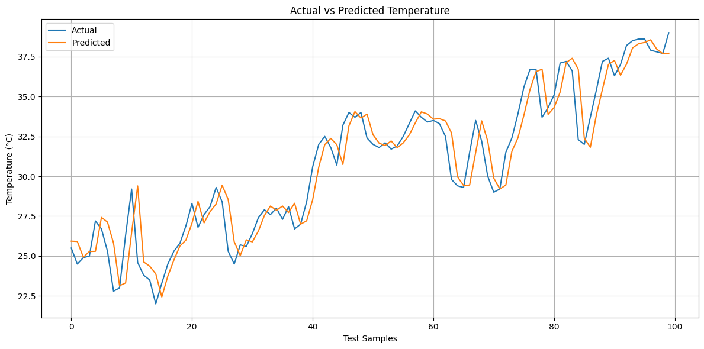

# 🌦️ Weather Temperature Prediction for Indian Cities

A machine learning project that predicts the **next day's maximum temperature** for major Indian cities using historical daily weather data from **2000 to 2024**.

The project uses **feature engineering** and a **Random Forest Regression** model to learn relationships between historical temperature, weather conditions, precipitation, wind, and time-based features.

---

## 🎯 Problem Statement

Weather conditions change continuously, and predicting temperature accurately can be useful for:

- Agriculture
- Energy management
- Transportation
- Weather planning
- Environmental analysis
- Smart city applications

This project explores how machine learning can use historical weather observations to predict the **next day's maximum temperature**.

---

## 🚀 Project Objective

The main objective is to build a machine learning model that can:

- Predict the next day's maximum temperature
- Learn patterns from historical weather data
- Use lag-based temperature features
- Use rolling temperature statistics
- Incorporate weather and wind conditions
- Evaluate regression performance using standard metrics
- Provide a reusable prediction script

---

## 📊 Dataset

The dataset contains daily weather observations from:

**January 1, 2000 to December 31, 2024**

### 🏙️ Cities

The project includes 10 major Indian cities:

- Delhi
- Mumbai
- Kolkata
- Chennai
- Bangalore
- Hyderabad
- Ahmedabad
- Pune
- Jaipur
- Lucknow

### 📌 Dataset Size

- Approximately **91,320 daily records**
- **12 original weather features**
- 10 Indian cities
- 25 years of historical data

---

## 🔑 Main Features

The original dataset contains:

- `city`
- `date`
- `temperature_2m_max`
- `temperature_2m_min`
- `apparent_temperature_max`
- `apparent_temperature_min`
- `precipitation_sum`
- `rain_sum`
- `weather_code`
- `wind_speed_10m_max`
- `wind_gusts_10m_max`
- `wind_direction_10m_dominant`

### 🧠 Engineered Features

Additional features were created to capture temporal patterns:

- `month`
- `temp_lag_1`
- `temp_lag_2`
- `temp_lag_3`
- `temp_lag_7`
- `temp_rolling_3`
- `temp_rolling_7`

### 🎯 Target Variable

The target variable is:

```text
target_temperature
```

It represents the next day's maximum temperature.

---

## 📊 Actual vs Predicted Temperature

The following graph compares the actual temperatures with the temperatures predicted by the Random Forest model on the test dataset.

<p align="center">
  
</p>

---

## 🧠 Machine Learning Approach

The project follows this workflow:

```text
Historical Weather Data
          ↓
Data Cleaning
          ↓
Feature Engineering
          ↓
Lag & Rolling Features
          ↓
Train/Test Split
          ↓
Model Training
          ↓
Model Evaluation
          ↓
Next-Day Temperature Prediction
---

## 🛠️ Technologies Used

- Python
- Pandas
- NumPy
- Scikit-learn
- Matplotlib
- Joblib
- Jupyter Notebook
- Google Colab
- Visual Studio Code
- Git
- GitHub


---

## 📁 Project Structure

```text
weather-temperature-prediction/
│
├── data/
│   └── india_2000_2024_daily_weather.csv
│
├── images/
│   └── actual_vs_predicted.png
│
├── notebooks/
│   └── weather_temperature_prediction.ipynb
│
├── src/
│   └── predict.py
│
├── .gitignore
├── README.md
└── requirements.txt

> Note: The trained model is excluded from GitHub because the `.pkl` file is approximately 1.14 GB and exceeds GitHub's 100 MB file size limit.

---

## ⚙️ Installation

Clone the repository:

```bash
git clone https://github.com/naveenk-cs/weather-temperature-prediction.git
```

Go into the project directory:

```bash
cd weather-temperature-prediction
```

Install the required dependencies:

```bash
pip install -r requirements.txt
```

---

## ▶️ Usage

The complete machine learning workflow is available in:

```text
notebooks/weather_temperature_prediction.ipynb
```

The prediction script is available in:

```text
src/predict.py
```

The notebook includes:

- Data loading
- Data preprocessing
- Feature engineering
- Model training
- Model evaluation
- Temperature prediction
- Visualization

---

## 👨‍💻 Author

Naveen

B.Tech Student | AI & Machine Learning Enthusiast

Interested in:
- Artificial Intelligence
- Machine Learning
- Python
- Data Science
- Software Development

---

## ⭐ Project

If you find this project useful or interesting, consider giving the repository a star.

GitHub Repository:
https://github.com/naveenk-cs/weather-temperature-prediction
